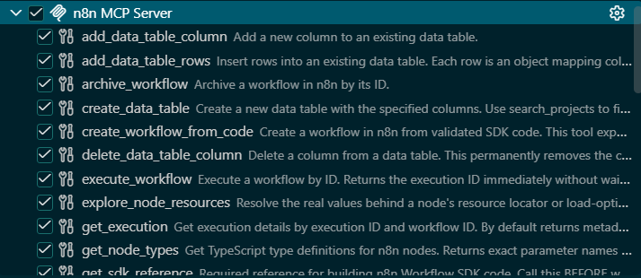
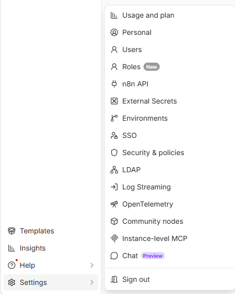
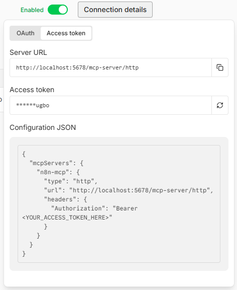
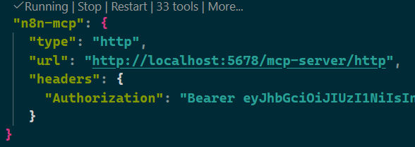
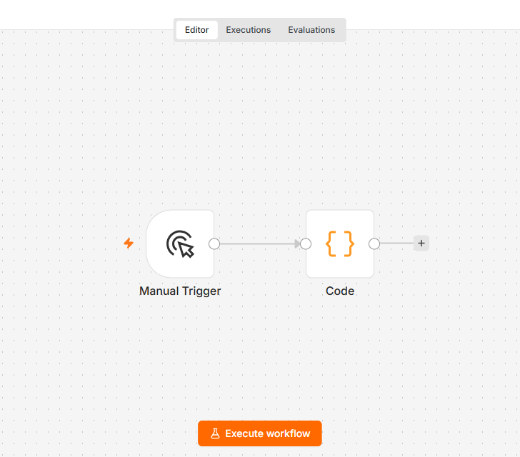
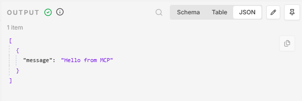
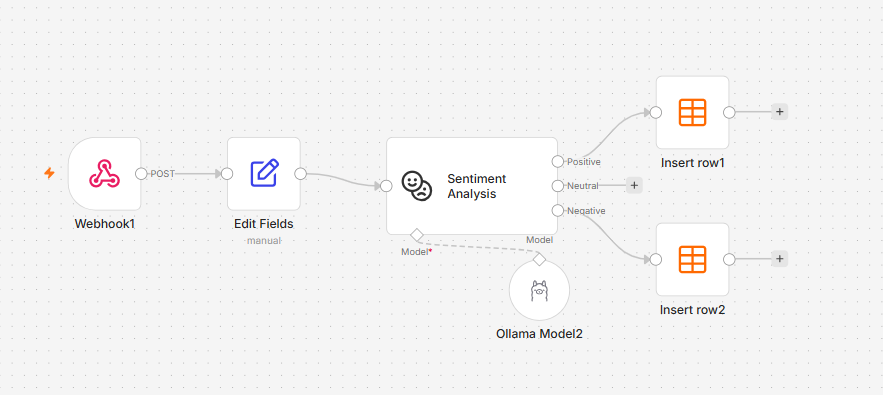

# Create your workflows in n8n with our MCP Server and natural language

n8n is a powerful platform that allows you to create workflows that solve real problems thanks to its low-code drag-and-drop interface. While that approach is already strong, getting started can be made even easier with AI assistance. With our MCP Server, you can now create workflows in n8n with natural language so you're even faster at turning ideas into reality.

## Learning Objectives

In this tutorial, you will learn how to:

- Connect your Agent to the n8n MCP Server.
- Interact with your n8n MCP Server using natural language.
- Create a workflow with a prompt.

## MCP

MCP, or Model Context Protocol, is a protocol that makes it easy for your agent to consume features, gain needed context, and interact with your tools in a structured way. This is important because before MCP existed as a standard, everyone was building their own way to connect agents to tools, which led to duplicated work and a lot of wasted time. Thanks to this standardization, you can easily connect your Agent with any MCP Server out there and get productive right away.

## n8n MCP Server

What about n8n's MCP Server? It is a very capable MCP Server, not only for creating workflows.

In this case, n8n's MCP Server can handle a wide range of tasks, including workflow creation, management, data access, and much more. See the image below for a non-exhaustive list of the capabilities of n8n's MCP Server.



This list only shows a fraction of what this server can do for you and you can find more information on the n8n MCP Server in our [documentation](https://docs.n8n.io/connect/connect-to-n8n-mcp-server).

## Our problem: Creating a workflow

As stated before, even though creating a workflow in n8n is easy, it can be made even easier with AI assistance. What we need to do to get there is the following:

1. Enable the n8n MCP Server in Settings.
2. Grab the credentials.
3. Install it in our chosen Agent environment.
4. Prompt the Agent and see the workflow being created.

Now that we have a good mile-high view, let's carry out these tasks one by one.

### 1 - Enable the n8n MCP Server in Settings

To enable the MCP Server, follow these steps:

1. Navigate to the main page "http://localhost:5678/home/workflows"
1. Select "instance-level MCP" and you will be taken to the correct page to manage the MCP Server.

   

1. Toggle it so it says "enabled"
1. Grab the credentials from Connection details

   

   Make sure you select access token and copy the configuration JSON, it should look something like so:

   ```json
   {
     "mcpServers": {
      "n8n-mcp": {
        "type": "http",
        "url": "http://localhost:5678/mcp-server/http",
        "headers": {
          "Authorization": "Bearer <YOUR_ACCESS_TOKEN_HERE>"
        }
      }
     }
   }

   ```

   The access token can be found in the "Access token" field above.

### 2 - Install it the MCP Server in Visual Studio Code

Now that we have all the information needed to connect the MCP Server, let's head over to our text editor of choice, Visual Studio Code.

1. Create a file called `mcp.json` in the `.vscode` folder of your project and add a "mcpServers" or "servers" element (both are supported).

   Your `mcp.json` file should look like this:

   ```json
   {
        "mcpServers": {
            "n8n-mcp": {
              "type": "http",
              "url": "http://localhost:5678/mcp-server/http",
              "headers": {
                "Authorization": "Bearer <YOUR_ACCESS_TOKEN_HERE>"
              }
            }
        }
   }
   ```

   Make sure to replace `<YOUR_ACCESS_TOKEN_HERE>` with the access token you copied from the n8n MCP Server settings.
   
1. Connect the MCP Server by clicking the "Play" icon right above your server entry. This should start the server, and you should see a checkmark indicating that the server is connected.

   
   
Next, we'll move on to the final step, which is prompting the Agent to create a workflow in n8n.

### 3 - Prompt the Agent and see the workflow being created

Now we've come to the final step, which is prompting the Agent to create a workflow and see it being created in n8n.

Make sure your GitHub Copilot Chat is open so you can paste the prompt below:

```text
create a new n8n workflow called "Test", add a manual trigger node and Code node that returns { "message": "Hello from MCP" }
```

1. Paste the prompt above, and you should see the Agent working in your chat window.

   After a few seconds, you should see it reference the `content.json` file being created. Once the Agent has finished, you should see a message similar to the one below, indicating the successful creation of the workflow:

   ```text
   Created:

   Name: Test
   Nodes:
     Manual Trigger
     Code (returns [{ json: { message: 'Hello from MCP' } }])
   Details:

   Workflow ID: <workflow_id>
   URL: http://localhost:5678/workflow/<workflow_id>
   Project: Your name <your email> (personal project)
   ```
   
   
1. Navigate to the URL provided by the Agent, and you should see the workflow created.

   You should see something like this:

   

1. Test the workflow by clicking the "Execute Workflow" button.

   You should see the workflow execute correctly.

   Select the Code node, and you should see output like this:

   


Great, you did it! You have successfully created a workflow with n8n's MCP Server and natural language. You can now explore the workflow and use more advanced prompts to create more complex workflows.

### Optional: Try creating this AI workflow with a prompt

As an optional exercise, now that you know how things work, try creating a workflow using the following prompt:

```text
Create a workflow that does sentiment analysis. It should consist of a web hook, that connects to an Edit Fields, that connects to Sentiment Analysis (using Ollama). A positive outcome should write to a data table called Positive and negative should write to a data table called Negative
```

You should get a workflow resembling the below image:



In this more advanced workflow, you might need to ensure you map all the inputs correctly but having the nodes and connections created is a big win.

This workflow can be used to rate customer feedback on products in an e-commerce for example. As you can see, n8n can solve real problems and with the help of AI, you can get going even faster.

## Summary

In this tutorial, we have learned how to connect our Agent to the n8n MCP Server, interact with it using natural language, and create a workflow with a prompt. 

What you've seen here is how the MCP Server does the heavy lifting for you, so you can focus on the problems you want to solve.

The n8n MCP Server has more than 30 tools available to you, so you can explore and use them to create even more complex workflows. You can find more information on the n8n MCP Server in our [documentation](https://docs.n8n.io/connect/connect-to-n8n-mcp-server).


